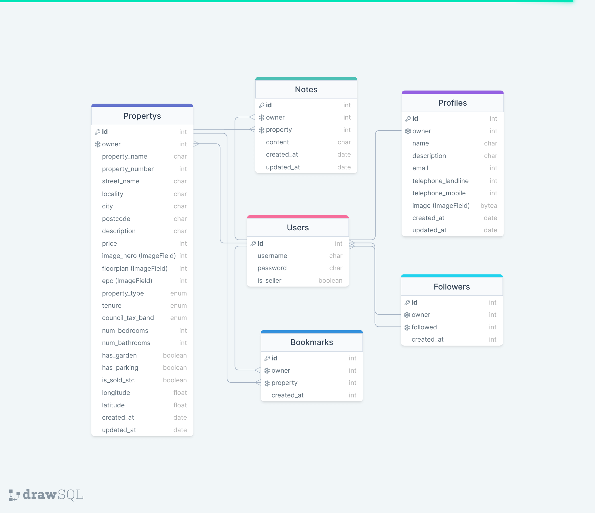

# Property Direct API

Property Direct is a proof of concept property listing website. It aims to allow users to sell their homes in a peer-to-peer environment to avoid estate agent fees. Registered sellers can list properties for sale, which can then be viewed by visitors. Enquires can be made about properties by registered users, who gain access to contact information (added by sellers to their profiles) by registering. This repository contains the API portion of the project, created with the Django REST framework, which serves information and authentication functionality to the frontend portion of the project.

The site uses a custom user model to restrict functionality based on an authenticated users account type:

- Only users registered as sellers can create, update and delete property.
- Only sellers profiles and the property listing they create are publicly visible.
- All other user content is private (other than profile and property stats):
  - A non-seller users profile is private and can only be viewed by its owner.
  - Profile Update and Delete functionality are restricted to profile owner.
  - Notes, Bookmarks and Follower information are private to their respective owners.
  - Notes, Bookmarks and Follower CRUD functionality is restricted to the respective owner.

## Demo

- [API - Live Deployment Link](https://ci-pp5-property-direct-api.herokuapp.com)

### Frontend Project Links

- [Frontend - Repository](https://github.com/ianmeigh/property-direct-frontend)
- [Frontend - Deployment](https://ci-pp5-property-direct.herokuapp.com)

## TOC

- [User Stories and Tasks](#user-stories-and-tasks)
- [Database Schema](#database-schema)
  - [Design changes](#design-changes)
  - [Future Features](#future-features)
- [Testing](#testing)
  - [Code Fixes](#code-fixes)
- [Technologies Used](#technologies-used)
  - [Languages and Frameworks Used](#languages-and-frameworks-used)
  - [Python Modules Used](#python-modules-used)
  - [Packages Used](#packages-used)
  - [Programs and Tools Used](#programs-and-tools-used)
- [Deployment](#deployment)
  - [Forking the GitHub Repository](#forking-the-github-repository)
  - [Making a Local Clone](#making-a-local-clone)
  - [Deploying with Heroku](#deploying-with-heroku)
- [Credits](#credits)
  - [Online resources](#online-resources)
  - [Code](#code)
  - [Acknowledgments](#acknowledgments)

## User Stories and Tasks

Development of the API was in service of delivering users stories created for the frontend project. All user stories have been documented in a separate file which can be viewed [here](https://github.com/ianmeigh/property-direct-frontend/blob/main/USERSTORIES.md).

Development tasks for the API were created as issues and linked to the projects Kanban board which can be found [here](https://github.com/users/ianmeigh/projects/1/views/6).

## Database Schema

Models were created based on the database schema design as below. The CustomUser model was created first as this extended the AbstractUser class to allowed a Seller role to be added to accounts to septate functionality. The remaining models were then created as required by the user stories.



### Design changes

The original database schema can be viewed [here](docs/database-schema-v1.png) and included extra tables for Articles and Comments which have not been implemented in this version of the application due to time constraints.

### Future Features

- Articles to allow the site owners to post content about property sales and site usage for users.
- Article Comments to interact with users, gauge article response and improve future content.
- Automate the addition of energy performance certificates to properties by leveraging the UK Governments [Domestic Energy Performance Certificates API](https://epc.opendatacommunities.org/docs/api/domestic).
- Direct messaging between users and sellers to facilitate property sales withing the frontend application.
- Match users with law firms to facilitate sale completion and provide fee comparison services.
- Seller ratings to build trust in brands and discourage poor service.
- Implement the Google geocoding service as to provide redundancy in the event the primary source of information experiences downtime.
  - To restrict the use of the Google Geocoding API key requires an IP address. This requires the use of [Heroku Proximo](https://devcenter.heroku.com/articles/proximo) which has a small cost attached.
  - Implementation was dreamed out of scope at this stage of development due to the consistent reliability of the primary API ([postcodes.io](https://postcodes.io)) and the scale of this project.
  - The use of the [GeoPy](https://geopy.readthedocs.io/en/stable/), which allows connection to multiple third-party geocoding services, was also explored and will be considered for future use if API reliability becomes an issue.
  - Search auto-complete and the use of places (City or Region) rather than postcode.

## Testing

A separate testing document has been created as [TESTING.md](TESTING.md)

### Code Fixes

Please see the [click here](https://github.com/ianmeigh/property-direct-backend/search?q=fix+NOT+merge&type=commits) to view a list of bug fixes for this project.

## Technologies Used

### Languages and Frameworks Used

- Python
- [Django](https://pypi.org/project/Django/3.2.14/) - High-level Python Web framework used to develop the project.
- [djangorestframework](https://pypi.org/project/djangorestframework/3.14.0/) - Toolkit for building web API's with Dajngo.

### Python Modules Used

- Built-in Packages/Modules
  - [math](https://docs.python.org/3/library/math.html) - The trigonometric functions acos, cos and sin and the constant pi from the math module were used in longitude and latitude calculations.
  - [pathlib](https://docs.python.org/3/library/pathlib.html) - Used to work with filepaths.
  - [os](https://docs.python.org/3/library/os.html) - This module provides a portable way of using operating system dependent functionality.

### Packages Used

- External Python Packages
  - [cloudinary](https://pypi.org/project/cloudinary/1.30.0/) - Cloudinary intergration.
  - [django-cloudinary-storage](https://pypi.org/project/django-cloudinary-storage/0.3.0/) - Cloudinary intergration.
  - [dj-database-url](https://pypi.org/project/dj-database-url/0.5.0/) - Allows the use of 'DATABASE_URL' environmental variable in the Django project settings file to connect to a PostgreSQL database.
  - [django-allauth](https://pypi.org/project/django-allauth/0.51.0/) - Set of Django application used for account registration, management and authentication.
  - [dj-rest-auth](https://pypi.org/project/dj-rest-auth/2.2.5/) - API endpoints for handling authentication in Django Rest Framework.
  - [django-filter](https://pypi.org/project/django-filter/22.1/) - Application that allows dynamic QuerySet filtering from URL parameters.
  - [djangorestframework-simplejwt](https://pypi.org/project/djangorestframework-simplejwt/5.2.1/) - JSON Web Token authentication backend for the Django REST Framework.
  - [django-cors-headers](https://pypi.org/project/django-cors-headers/3.13.0/) - Django App that adds CORS headers to responses.
  - [gunicorn](https://pypi.org/project/gunicorn/20.1.0/) - Python WSGI HTTP Server.
  - [Pillow](https://pypi.org/project/Pillow/9.2.0/) - Fork of PIL, the Python Imaging Library which provides image processing capabilities.
  - [psycopg2](https://pypi.org/project/psycopg2/2.9.3/) - Python PostgreSQL database adapter.
  - [python-dotenv](https://pypi.org/project/python-dotenv/0.21.0/) - Set key-value pairs from `.env` file as environmental variables.
  - [haversine](https://pypi.org/project/haversine/2.7.0/) - Calculate the distance between 2 points using their longitude and latitude.

### Programs and Tools Used

- [drawSQL](https://drawsql.app/) - Create Database Schema/ERD
- [Visual Studio Code:](https://code.visualstudio.com/)
  - Visual Studio Code was used as my code editor for this project. A full list
    of plugins used can be found later in this section.
- [Git](https://git-scm.com/)
  - Git was used for version control, using the terminal to commit to Git and
    Push to GitHub.
- [GitHub:](https://github.com/)
  - GitHub is used to store the projects code after being pushed from Git.
- The following modules were installed or enabled in [Visual Studio
Code](https://code.visualstudio.com/) to assist with formatting and code
linting:
  - [flake8](https://github.com/pycqa/flake8) - Code Linter
  - [black](https://github.com/psf/black) - Code Formatter
  - [pycodestyle](https://pypi.org/project/pycodestyle/2.9.1/) - Code Linter
- The following [Visual Studio Code](https://code.visualstudio.com/) extensions
  were utilized in the production of this project:
  - [Rewrap](https://marketplace.visualstudio.com/items?itemName=stkb.rewrap) - Used to wrap comments.
  - [Code Spell Checker](https://marketplace.visualstudio.com/items?itemName=streetsidesoftware.code-spell-checker) - Used to spell check content and commits.
  - [indent-rainbow](https://marketplace.visualstudio.com/items?itemName=oderwat.indent-rainbow) - Makes indentation easier to read.
  - [markdownlint](https://marketplace.visualstudio.com/items?itemName=DavidAnson.vscode-markdownlint) - Markdown linting and style checking for Visual Studio Code.
  - [autoDocstring](https://marketplace.visualstudio.com/items?itemName=njpwerner.autodocstring) - Generates python docstrings templates automatically
  - [TODO Highlight](https://marketplace.visualstudio.com/items?itemName=wayou.vscode-todo-highlight) - highlight TODOs, FIXMEs, and any keywords, annotations.
  - [Todo Tree](https://marketplace.visualstudio.com/items?itemName=Gruntfuggly.todo-tree) - Show TODO, FIXME, etc. comment tags in a tree view

## Deployment

### Forking the GitHub Repository

By forking the GitHub Repository we make a copy of the original repository on
our GitHub account to view and/or make changes without affecting the original
repository by using the following steps...

1. Log in to GitHub and locate the [GitHub
   Repository](https://github.com/ianmeigh/property-direct-backend)
1. At the top of the Repository (not top of page) just above the "Settings"
   Button on the menu, locate the "Fork" Button.
1. Click the button (not the number to the right) and you should now have a copy
   of the original repository in your GitHub account.

### Making a Local Clone

**NOTE**: It is a requirement of the is project that you have Python version 3.8 or higher installed locally.

1. Log in to GitHub and locate the [GitHub Repository](https://github.com/ianmeigh/property-direct-backend).
1. Under the repository name, click "Code".
1. To clone the repository using HTTPS, under "HTTPS", copy the link.
1. Open your local terminal with git installed
1. Change the current working directory to the location where you want the cloned directory to be created.
1. Type `git clone`, and then paste the URL you copied in Step 3.

    ```console
    ~$ git clone https://github.com/ianmeigh/property-direct-backend.git
    ```

1. Press Enter. Your local clone will be created.

    ```console
    $ git clone https://github.com/ianmeigh/property-direct-backend.git
    > Cloning into `test-dir`...
    > remote: Counting objects: 10, done.
    > remote: Compressing objects: 100% (8/8), done.
    > remove: Total 10 (delta 1), reused 10 (delta 1)
    > Unpacking objects: 100% (10/10), done.
    ```

    [Click here](https://help.github.com/en/github/creating-cloning-and-archiving-repositories/cloning-a-repository#cloning-a-repository-to-github-desktop) for a more detailed explanation of the process above with pictures.

1. Change the current working directory to the cloned project folder (this will be a child directory in the location you cloned the project).

1. It is recommended to use a virtual environment during development ([learn more about virtual environments](https://realpython.com/python-virtual-environments-a-primer/)). If you would prefer not to use on please skip the following steps:
    1. Create a virtual environment in the projects working directory by entering the following command in the same terminal window used for the steps above `python3 -m venv .venv`.
    1. Before use, the virtual environment will need to be activated using the command `source .venv/bin/activate` in the same terminal window used previously.
1. Packages required by the project can now using the command `pip install -r requirements.txt`
1. In the cloned directory, rename the file `.env-example` to `.env` and populate it with the information required.
1. Make Django migrations using the command `./manage.py migrate`.

### Deploying with Heroku

**NOTE**: It is a prerequisite of deployment to Heroku that you already have access to the following:

- A Cloudinary account, create one for free at [https://cloudinary.com](https://cloudinary.com).

**NOTE**: It is assumed you have followed all deployment instructions listed in this readme starting with the section titled 'Forking the GitHub Repository'.

1. Log in to [Heroku](https://www.heroku.com/) and if not taken there automatically, navigate to your personal app dashboard.
1. At the top of the page locate the 'New' drop down, click it and then select 'Create new app'.
1. Give your application a unique name, select a region appropriate to your location and click the 'Create app' button.
1. Your app should now be created, so from the menu towards the top of the page select the 'Resources' section.
1. Search for 'Heroku Postgres' under the Add-ons section and add it.
1. From the menu towards the top of the page select the 'Settings' section and lick 'Reveal Config Vars' in the Config vars section. Enter the following key / value pairings:
    1. Key as `ALLOWED_HOSTS` and the value as the name of you project with '.herokuapp.com' appended to the end e.g.  `example-app.herokuapp.com`. Click the Add button.
    1. Key as `CLOUDINARY_URL` and the value as your cloudinary API Environment variable e.g. `cloudinary://**************:**************@*********`. Click the Add button.
    1. Key as `SECRET_KEY` and the value as a complex string which will be used to provide cryptographic signing. The use of a secret key generator is recommended such as [https://djecrety.ir](https://djecrety.ir/). Click the Add button.
    1. Ensure the key `DATABASE_URL` is already populated. This should have been created automatically by Heroku.
    1. The `DATABASE_URL` should be copied into your local `.env`, created during the cloning process.
    1. To make authenticated requests to this API (e.g. from a fontend application) you are required to add the key `CLIENT_ORIGIN` with the value set as the URL you will be sending the authentication request from.
    1. Additionally, a `CLIENT_ORIGIN_DEV` key can be set with the value of a development server (IP or URL) for use during local development.
1. Open the `.env` file in the project directory and delete the key / value pair `DEV_ENVIRONMENT_DATABASE = True` before saving the file. This can be added back after the next step to ensure local development changes will not alter the remote database.
1. Navigate to the 'Deploy' page using the menu towards the top of the page.
1. Select 'GitHub' from the 'Deployment method' section and you will be prompted to 'Connect to GitHub'.
1. Once connected to your GitHub account you will be able to search for your repository which contains the forked 'property-direct-backend' repository.
1. Once the repository is found click 'Connect'.
1. At the bottom of the page find the section named 'Manual deploy', select the 'main' branch in the drop down and click the 'Deploy' button.
1. Once deployment is complete, click the 'View' button to load the URL of the deployed application.

## Credits

### Online resources

- [Django Documentation](https://docs.djangoproject.com/en/3.2/)
- [Django REST Documentation](https://www.django-rest-framework.org/)
- [Python Documentation](https://docs.python.org/3/)

### Code

- Code Institute DRF Tutorial Project, used through as a basis for the creation of this API
  - CREDIT: Code Institute DRF-API Tutuorial Project
  - URL: [https://github.com/Code-Institute-Solutions/drf-api](https://github.com/Code-Institute-Solutions/drf-api)

- How to extend the User Model in Django with AbstractUser
  - CREDIT: Pyplane
  - URL: [https://www.youtube.com/watch?v=1BeZxMbSZNI](https://www.youtube.com/watch?v=1BeZxMbSZNI)

- Registration and Authentication in Django apps with dj-rest-auth
  - CREDIT: Bruno Michetti
  - URL: [https://www.rootstrap.com/blog/registration-and-authentication-in-django-apps-with-dj-rest-auth/](https://www.rootstrap.com/blog/registration-and-authentication-in-django-apps-with-dj-rest-auth/)

- Creating Custom Exceptions with Django Rest Framework
  - CREDIT: ruddra - StackOverflow
  - URL: [https://stackoverflow.com/a/63129274](https://stackoverflow.com/a/63129274)

- Selecting points within a bounding circle (used in Property Search).
  - CREDIT: Chris Veness
  - URL: [https://www.movable-type.co.uk/scripts/latlong-db.html](https://www.movable-type.co.uk/scripts/latlong-db.html)

- Pass extra arguments to Serializer Class in Django Rest Framework (used in Property Search).
  - CREDIT: M.Void - StackOverflow
  - URL: [https://stackoverflow.com/a/38723709](https://stackoverflow.com/a/38723709)

- Method to add CORS_ALLOWED_ORIGINS as a list
  - CREDIT: CORS_ALLOWED_ORIGINS list adapted from @pakkONE , posted in the Code Institute Slack Community.

- Mocking API calls in Python Guide.
  - CREDIT: O'Brian Kimokot
  - URL: [https://auth0.com/blog/mocking-api-calls-in-python/](https://auth0.com/blog/mocking-api-calls-in-python/)

- Create a functioning Response object (mocking a response).
  - CREDIT: jonrsharpe - StackOverflow
  - URL: [https://stackoverflow.com/a/40361593](https://stackoverflow.com/a/40361593)

- Mock image raising error; invalid image or corrupt (Creating an image file for testing).
  - CREDIT: marcorichetta - forum.djangoproject.com
  - URL: [https://forum.djangoproject.com/t/mock-image-raising-error-invalid-image-or-corrupt/4513/2](https://forum.djangoproject.com/t/mock-image-raising-error-invalid-image-or-corrupt/4513/2)

### Acknowledgments

As always a huge thank you to my mentor Okwudiri Okoro. A huge thank you to my partner for her patience and support throughout this project.
